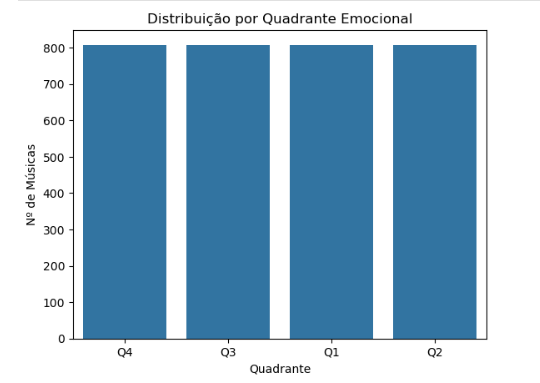
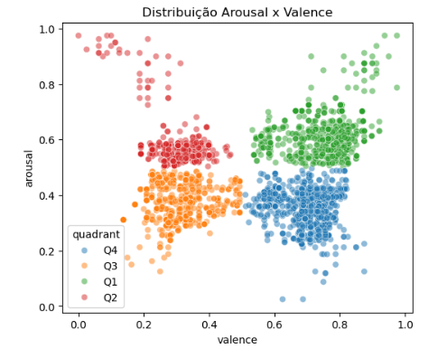
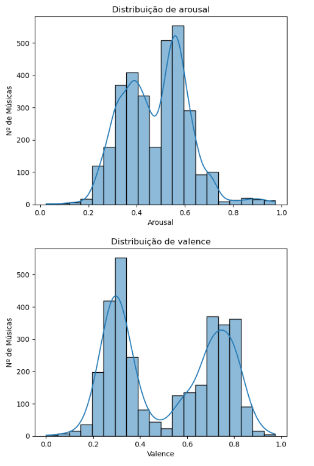
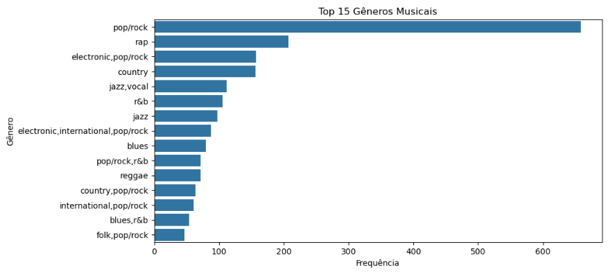
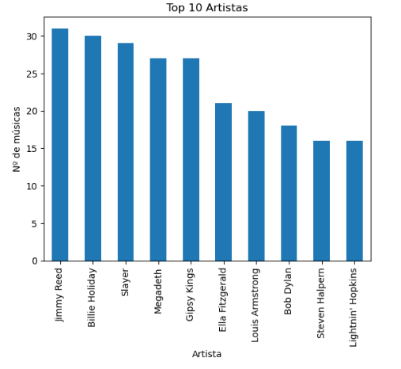
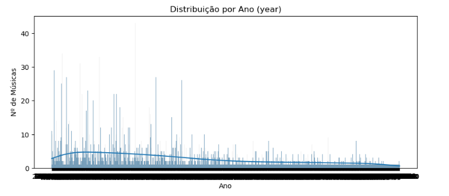
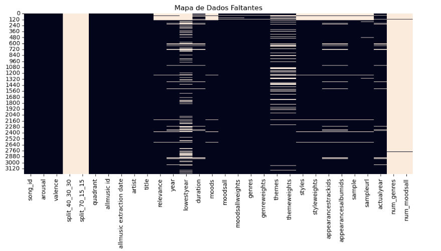

# Relatório Final – Projeto MERGE Dataset: ETL, Exploração & Redesign

## 1. Introdução

O MERGE Dataset foi usado para a tarefa de Reconhecimento de Emoção em Música (MER), contendo áudio, letras e anotações emocionais. No entanto, a sua organização original, distribuída em múltiplos ficheiros ZIP com diferentes subconjuntos, apresentava desafios significativos para a sua utilização. Problemas como a fragmentação dos dados, inconsistências na nomenclatura de colunas e a ausência de um esquema de dados unificado dificultavam o uso por parte de investigadores e entusiastas.

Este projeto teve como objetivo principal endereçar estes problemas através de um processo de engenharia de dados, refatorando o dataset para melhorar a sua usabilidade, reprodutibilidade e integração com ferramentas modernas de análise de dados.

## 2. Objetivos

Os objetivos centrais deste projeto foram:

-   Reestruturar e padronizar o MERGE dataset, consolidando os seus múltiplos ficheiros.
-   Facilitar o uso do dataset para análises de emoção em música, providenciando um loader de dados simplificado.
-   Criar scripts de Extração, Transformação e Carga (ETL) para automatizar a centralização e limpeza dos dados.
-   Realizar uma análise exploratória para compreender as características e distribuições do dataset.

## 3. Metodologia

O projeto foi executado seguindo uma metodologia estruturada de engenharia de dados.

### 3.1. Exploração Inicial e Scripts ETL

Inicialmente, os diversos subconjuntos do dataset foram analisados (e.g., `MERGE_Audio_Balanced`, `MERGE_Bimodal_Complete`). Para cada subconjunto, foi criado um script ETL em formato de Jupyter Notebook (ex: `audio_balanced.ipynb`). Estes scripts foram responsáveis por:
1.  **Extrair** dados de múltiplos ficheiros-fonte: os metadados principais (`...metadata.csv`), os valores de emoção (`...av_values.csv`) e as diferentes divisões de treino/validação/teste (`tvt_...csv`).
2.  **Transformar** os dados, unificando-os através de um "merge" e padronizando nomes de colunas inconsistentes (e.g., de `Song` ou `Audio_Song` para `song_id`).
3.  **Carregar** o resultado num único ficheiro `master_metadata_....csv` por subconjunto, armazenado na pasta `/metadata` do projeto.

### 3.2. Redesign do Schema e Loader

Foi definido um schema padronizado para os ficheiros master, documentado no `data_dictionary.md`. Para facilitar o acesso a estes novos ficheiros, foi desenvolvido um módulo Python (`scripts/loader.py`) contendo a função `load_merge_master`. Esta função serve como uma API de alto nível, permitindo carregar e filtrar os dados com base em múltiplos parâmetros como `split`, `quadrant` ou `artist`.

### 3.3. Análise Exploratória de Dados (EDA)

Utilizando a função de carregamento desenvolvida, foi realizada uma análise exploratória no notebook `EDA.ipynb`. Foram utilizadas as bibliotecas Matplotlib e Seaborn para gerar visualizações sobre a distribuição das classes, características emocionais, conteúdo e integridade dos dados.

## 4. Resultados

A análise exploratória, realizada no subconjunto `master_metadata_audio_balanced`, revelou as seguintes características:

### 4.1. Análise da Distribuição de Classes e Emoções

A análise da distribuição de classes (Figura 1) revela que o dataset é notavelmente balanceado, com uma contagem quase idêntica de músicas em cada um dos quatro quadrantes emocionais. Esta é uma característica ideal, pois previne o enviesamento do modelo de classificação para uma emoção específica.

O gráfico de dispersão entre Arousal e Valence (Figura 2) valida a estrutura do dataset. Observam-se quatro agrupamentos distintos de dados, cada um correspondendo a um quadrante, o que demonstra a correlação direta entre os valores contínuos de emoção e as classes categóricas.

Adicionalmente, a distribuição bimodal (dois picos) observada para os valores de Arousal e Valence (Figura 3) é consistente com o modelo de emoção em quadrantes, onde as músicas tendem a se agrupar em extremos de alta/baixa energia e positividade/negatividade.

### 4.2. Análise de Conteúdo e Metadados

A análise de gêneros musicais (Figura 4) mostra uma predominância expressiva do gênero 'pop/rock'. Embora o dataset contenha uma variedade de gêneros, esta concentração sugere que qualquer modelo treinado com estes dados terá, provavelmente, um melhor desempenho e generalização para músicas dentro deste estilo.

A lista dos artistas mais frequentes (Figura 5) revela uma diversidade de estilos musicais, abrangendo desde o Blues e Jazz clássico até o Heavy Metal, o que enriquece a variedade do dataset apesar da predominância do gênero pop/rock.

A Figura 6 mostra que o dataset possui uma grande variedade temporal, com músicas que abrangem muitas décadas, apesar da difícil legibilidade do eixo dos anos.

### 4.3. Análise de Integridade dos Dados

O mapa de dados faltantes (Figura 7) indica que os campos centrais para a tarefa de classificação (ID da música e valores emocionais) estão 100% completos. No entanto, muitos metadados secundários, como 'themes' e 'styles', são esparsos. Uma observação crítica é a ausência de dados nas colunas de 'split', indicando um problema na consolidação deste subconjunto específico, o que exigiria atenção antes de treinar um modelo.

## 5. Discussão

O trabalho realizado melhorou substancialmente a usabilidade do MERGE Dataset. A principal melhoria foi a **centralização da informação**. Dados antes espalhados por múltiplos ficheiros foram consolidados num único ficheiro master por subconjunto, eliminando a necessidade de processos manuais de fusão por parte do utilizador final. A **padronização** dos nomes de colunas e a criação do **loader** (`scripts/loader.py`) abstraem a complexidade, permitindo o acesso aos dados de forma intuitiva e programática.

As **visualizações** foram cruciais para a validação do trabalho e para a compreensão do dataset. O gráfico de dispersão (Figura 2), por exemplo, validou visualmente a correta atribuição dos quadrantes. Por outro lado, o mapa de dados faltantes (Figura 7) revelou um problema crítico com as colunas de `split` no ficheiro gerado, uma descoberta que não seria trivial sem a visualização.

Como **limitações e melhorias futuras**, destaca-se o processo de ETL. O uso de um notebook separado para cada subconjunto resultou em repetição de código. Uma evolução natural seria refatorar estes scripts numa única ferramenta parametrizável. Adicionalmente, os scripts de ETL utilizam caminhos de ficheiro absolutos, o que prejudica a reprodutibilidade do projeto. A sua conversão para caminhos relativos é uma melhoria recomendada.

## 6. Conclusão

Este projeto transformou o MERGE Dataset de um conjunto de dados fragmentado para um recurso estruturado, documentado e de fácil acesso. Através da implementação de um pipeline de ETL e do desenvolvimento de um loader de dados, foram superados os principais desafios de usabilidade da versão original. A análise exploratória subsequente não só validou a qualidade do trabalho de engenharia de dados, como também produziu insights valiosos sobre as características do dataset, deixando-o preparado para futuras investigações na área de Reconhecimento de Emoção em Música.